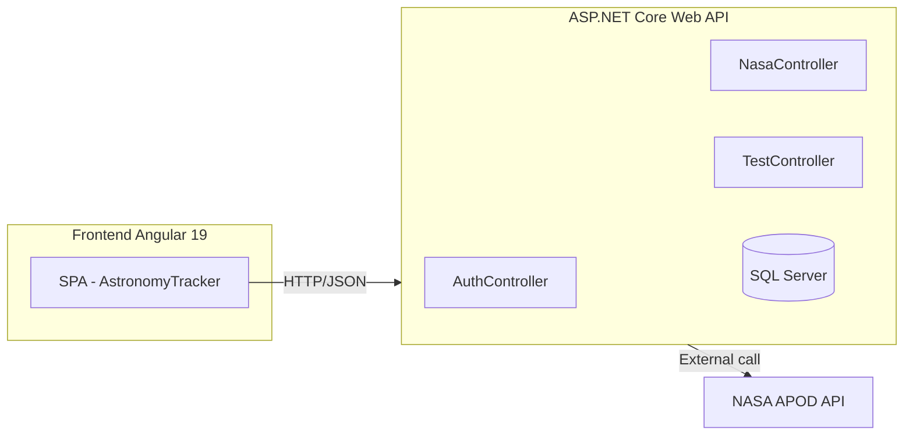

# 🌌 AstronomyTracker

Uma aplicação full‑stack para explorar dados astronômicos (APOD/NASA), classificar imagens, consultar tendências e gerenciar autenticação de usuários. Este repositório é um monorepo com:
<p>
  <a href="https://dotnet.microsoft.com/"></a>
  <a href="https://learn.microsoft.com/aspnet/core"></a>
  <a href="https://learn.microsoft.com/ef/core/"></a>
  <a href="https://www.microsoft.com/sql-server"></a>
  <a href="https://angular.io/"></a>
  <a href="https://www.typescriptlang.org/"></a>
  <a href="https://nodejs.org/"></a>
  <a href="https://swagger.io/specification/"></a>
  <a href="https://jwt.io/"></a>
  <a href="https://automapper.org/"></a>
  <a href="https://docs.fluentvalidation.net/"></a>
  <a href="https://api.nasa.gov/"></a>
</p>
---

## 📸 Preview

<p align="center">
  
</p>

<p align="center">
  
</p>

<p align="center">
  
</p>

<p align="center">
  
</p>

> As imagens acima estão versionadas em `docs/screenshots/` neste repositório e são referenciadas pelos links públicos indicados.

---

## 📋 Índice

- 🏗️ Arquitetura
- 🧩 Componentes
- 🔧 Tecnologias
- 🚀 Como Executar
- 🗄️ Banco de Dados
- 🔌 API Endpoints
- 🧪 Testes
- 📁 Estrutura do Projeto
- 📚 Documentação Adicional
- 🔐 Configurações Avançadas
- 👨🏻‍💻 Autor

---

## 🏗️ Arquitetura

A aplicação segue uma arquitetura simples em duas camadas (API + SPA) e integra com a API pública da NASA (APOD).

### Diagrama de Alto Nível



### Fluxo Geral

- Usuário acessa SPA (Angular) e navega entre Home, Events, Gallery e About
- SPA chama a Web API (.NET) para autenticação, dados da NASA e recursos internos
- Web API consulta a NASA APOD quando necessário e persiste dados no SQL Server

---

## 🧩 Componentes

### 🌐 Frontend (Angular 19)
- SPA responsiva e moderna
- Integração com API via `environment.apiUrl`
- Build de produção em `dist/browser` (padrão Angular 17+)

### 🔙 Backend (ASP.NET Core 8)
- Controllers principais:
  - `AuthController` → registro, login, recuperação de senha, foto de perfil
  - `NasaController` → APOD do dia, calendário APOD, tendências/ratings
  - `TestController` → endpoints utilitários/saúde
- Camadas: DTOs, Mappings (AutoMapper), Middleware (JWT), Repositories/Services

---

## 🔧 Tecnologias

- Backend Framework: .NET 8, ASP.NET Core, EF Core (SQL Server)
- Segurança: JWT Bearer
- Utilidades: AutoMapper, FluentValidation
- Observabilidade: Swagger/OpenAPI
- Frontend: Angular 19, RxJS

---

## 🚀 Como Executar

### 🔧 Pré‑requisitos
- .NET 8 SDK
- Node 20+ e npm (ou pnpm)
- SQL Server local

### 🐱‍🏍 Opção Rápida (Windows)
- Script raiz: `start-dev.bat` — inicia backend e frontend de desenvolvimento

### 🔧 Manual

Backend:
1. `cd backend`
2. Configure `appsettings.Development.json` (ConnectionStrings, JWT, NASA, SMTP)
3. `dotnet restore`
4. (Opcional) `dotnet ef database update`
5. `dotnet run`

Frontend:
1. `cd frontendtrackerapi/astronomy-tracker`
2. `npm install`
3. Ajuste `src/environments/environment.ts` / `environment.production.ts` com `apiUrl`
4. `npm start` (ou `ng serve`)

---

## 🗄️ Banco de Dados

- Provider atual: SQL Server
- Migrations em `backend/Migrations`
- Connection string de dev em `backend/appsettings.Development.json`

Executar migration manualmente:

```bash
# na pasta backend
 dotnet ef database update
```

---

## 🔌 API Endpoints (visão geral)

Documentação interativa via Swagger quando a API está rodando.

Autenticação (exemplos esperados):
- `POST /api/auth/register`
- `POST /api/auth/login`
- `POST /api/auth/forgot-password`
- `POST /api/auth/reset-password`
- `POST /api/auth/validate-token`
- `PUT /api/auth/profile-picture`

NASA/APOD:
- `GET /api/nasa/apod?date=YYYY-MM-DD`
- `GET /api/nasa/apod/calendar?start=YYYY-MM-DD&end=YYYY-MM-DD`
- Tendências/ratings conforme guias internos (links abaixo)

Saúde/Testes:
- `GET /api/test/health`

> Para payloads detalhados e exemplos, consulte `backend/Documentation/NASA_API_GUIDE.md`, `SYNC_ENDPOINT_CORRECAO.md` e `TRENDS_ENDPOINT_CORRECAO.md`.

---

## 🧪 Testes

- Projeto de testes em `backend/WeatherTrackerAPI.Tests/`
- Executar: `dotnet test` (na pasta `backend`)

---

## 📁 Estrutura do Projeto

```
WeatherTrackerAPI/
├── backend/
│   ├── Controllers/            # Auth, Nasa, Test
│   ├── Data/                   # AppDbContext
│   ├── DTOs/                   # Dtos (Login, Register, Apod, etc.)
│   ├── Mappings/               # AutoMapperProfile
│   ├── Middleware/             # JWT Authentication Middleware
│   ├── Migrations/             # EF Core migrations
│   ├── Services/               # Regras de negócio
│   ├── Program.cs              # Bootstrap
│   └── appsettings.*.json      # Configurações
├── frontendtrackerapi/
│   └── astronomy-tracker/      # Angular 19 app
│       ├── src/environments/   # environment.ts / production.ts
│       └── angular.json        # build (dist/browser)
├── docs/
│   └── screenshots/            # Imagens usadas no README
└── *.md                        # Guias e relatórios
```

---

## 📚 Documentação Adicional

- `SETUP_GUIDE.md` — guia de configuração local
- `CORS_CONFIGURATION.md` — políticas e origens permitidas
- `backend/Documentation/NASA_API_GUIDE.md` — integração NASA/APOD
- `backend/Documentation/TRENDS_ENDPOINT_CORRECAO.md`
- `backend/Documentation/SYNC_ENDPOINT_CORRECAO.md`
- `APOD_CORRECTION_REPORT.md`, `Documentation/DEVELOPMENT_REPORT.md`

---

## 🔐 Configurações Avançadas

- JWT: `backend/Configurations/JwtSettings.cs`
- NASA: `backend/Configurations/NasaApiSettings.cs`
- SMTP: `backend/Configurations/SmtpSettings.cs` e `backend/email-settings-example.json`
- CORS: configurado em `backend/Program.cs`

---

## 👨🏻‍💻 Autor

- [Italo Rocha](https://github.com/ItaloRochaj)

