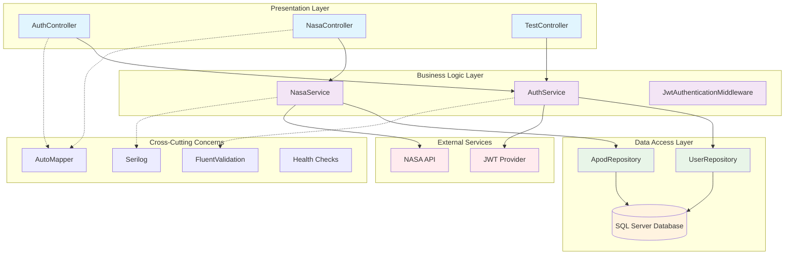
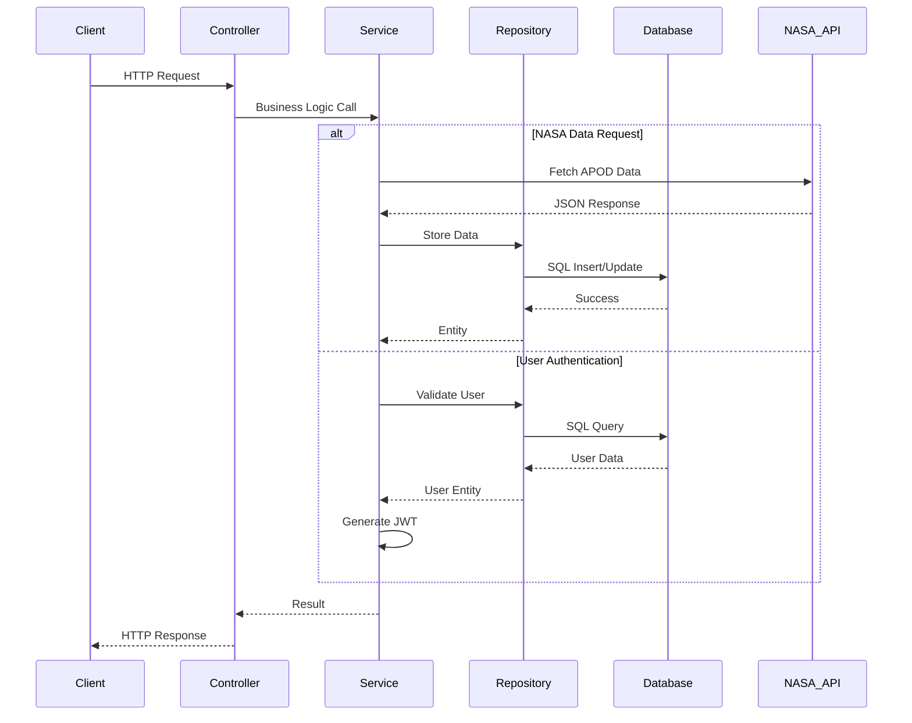
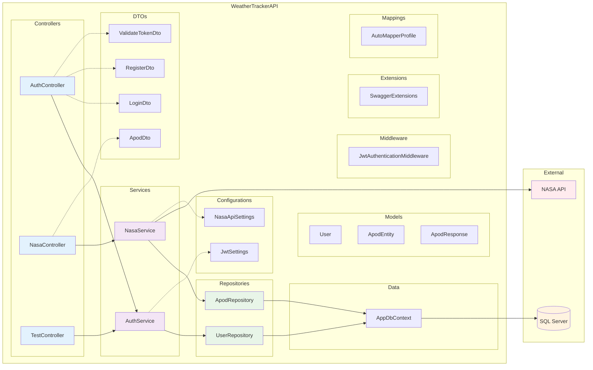

# WeatherTrackerAPI 🚀

Uma API RESTful desenvolvida em .NET 8 que integra com a NASA API para coletar, processar e armazenar dados astronômicos, fornecendo endpoints seguros para consulta de informações espaciais históricas e em tempo real.

## 🛠️ Tecnologias Utilizadas

[](https://dotnet.microsoft.com/)
[](https://www.microsoft.com/sql-server)
[](https://learn.microsoft.com/ef/)
[](https://swagger.io/)
[](https://jwt.io/)
[](https://serilog.net/)
[](https://docs.fluentvalidation.net/en/latest/)

---

## 📋 Índice
- [Visão Geral](#visão-geral)
- [Tecnologias Utilizadas](#tecnologias-utilizadas)
- [Arquitetura do Projeto](#arquitetura-do-projeto)
- [Funcionalidades](#funcionalidades)
- [Pré-requisitos](#pré-requisitos)
- [Configuração e Instalação](#configuração-e-instalação)
- [Estrutura do Projeto](#estrutura-do-projeto)
- [API Endpoints](#api-endpoints)
- [Autenticação e Autorização](#autenticação-e-autorização)
- [Banco de Dados](#banco-de-dados)
- [Configurações](#configurações)
- [Testes Unitários](#testes)
- [Documentação da API](#documentação-da-api)

## 🎯 Visão Geral
O WeatherTrackerAPI é uma aplicação backend desenvolvida como parte de uma avaliação técnica para demonstrar conhecimentos em:
- **Integração com APIs externas** (NASA API - Astronomy Picture of the Day)
- **Arquitetura em camadas** com .NET 8
- **Autenticação JWT**
- **Persistência de dados** com Entity Framework Core e SQL Server
- **Documentação** com Swagger/OpenAPI
- **Boas práticas** de desenvolvimento
- **Sistema de testes personalizado** desenvolvido em C# puro

### Objetivo Principal
Criar uma API que consuma dados da NASA API (Astronomy Picture of the Day - APOD), processe essas informações, as armazene em um banco de dados SQL Server e forneça endpoints seguros para consulta de dados históricos e tendências astronômicas.

---

## 🔐 Autenticação e Autorização

O WeatherTrackerAPI implementa autenticação **JWT (JSON Web Token)** para garantir segurança e acesso controlado aos endpoints.

Exemplo de requisição **Login** usando **Bruno API Client**:


- O usuário envia **e-mail** e **senha**
- A API retorna um **token JWT**
- Esse token deve ser utilizado no header `Authorization: Bearer {TOKEN}` para acessar os endpoints protegidos.

---

## 🛠️ Tecnologias Utilizadas

### Backend
- **.NET 8** - Framework principal
- **ASP.NET Core Web API** - Para criação da API REST
- **Entity Framework Core** - ORM para acesso ao banco de dados
- **SQL Server** - Banco de dados principal
- **AutoMapper** - Mapeamento entre objetos
- **JWT Bearer** - Autenticação e autorização

### Ferramentas e Bibliotecas
- **Swagger/OpenAPI** - Documentação da API
- **Serilog** - Logging estruturado
- **FluentValidation** - Validação de dados
- **BCrypt.Net** - Hash de senhas
- **Health Checks** - Monitoramento da aplicação
- **xUnit** - Framework de testes
- **Microsoft.AspNetCore.Mvc.Testing** - Testes de integração

## 🏗️ Arquitetura do Projeto

### Estrutura de Camadas



### Fluxo de Dados



### Diagrama de Componentes



### Principais Funcionalidades

#### 1. ✅ Integração com API de Terceiros
- **NASA APOD API**: Busca dados astronômicos diários
- **Processamento**: Transformação e validação dos dados
- **Cache**: Armazenamento em cache para otimização

#### 2. ✅ Banco de Dados SQL Server
- **Entity Framework Core**: ORM para acesso aos dados
- **Migrações**: Controle de versão do banco
- **Consultas otimizadas**: Queries eficientes

#### 3. ✅ Autenticação e Autorização
- **JWT Tokens**: Autenticação stateless
- **Roles**: Controle de acesso baseado em funções
- **Middleware personalizado**: Para logging e validação

## 📋 Pré-requisitos
- **.NET 8 SDK** ou superior
- **SQL Server** 2019 ou superior (ou SQL Server Express)
- **Visual Studio Code** ou **Visual Studio** (recomendado)
- **Git** para controle de versão

## ⚙️ Configuração e Instalação

### 1. Clone o repositório
```bash
git clone https://github.com/ItaloRochaj/WeatherTrackerAPI.git
cd WeatherTrackerAPI
```

### 2. Configure o banco de dados SQL Server

Certifique-se de que o SQL Server está executando e configure a connection string no `appsettings.json`:

```json
{
  "ConnectionStrings": {
    "DefaultConnection": "Server=localhost\\MSSQLSERVER01;Database=weather_trackerapi;User Id=developer;Password=YourPassword;TrustServerCertificate=true;"
  }
}
```

### 3. Configure as dependências da NASA API

Atualize a chave da API no `appsettings.json`:

```json
{
  "NasaApiSettings": {
    "BaseUrl": "https://api.nasa.gov/planetary/apod",
    "ApiKey": "SUA_CHAVE_NASA_API_AQUI"
  }
}
```

### 4. Restaure os pacotes e execute as migrações
```bash
dotnet restore
dotnet ef database update
```

### 5. Execute a aplicação

#### Opção 1: Executar a API Principal
```bash
# Navegar para o diretório raiz do projeto
cd WeatherTrackerAPI

# Executar a API
dotnet run --project WeatherTrackerAPI.csproj
```

#### Opção 2: Executar via Solution
```bash
# Partir da raiz do projeto
dotnet run --project WeatherTrackerAPI.csproj
```

#### Opção 3: Executar apenas os Testes
```bash
# Executar testes unitários
cd WeatherTrackerAPI.Tests
.\RunTests.ps1

# Ou executar build + testes
cd ..
.\BuildAndTest.ps1
```

A aplicação estará disponível em:
- **HTTP**: `http://localhost:5170`
- **HTTPS**: `https://localhost:7230`
- **Swagger UI**: `https://localhost:7230/swagger` (página inicial)

## 🗂️ Estrutura do Projeto

```text
WeatherTrackerAPI/
├── Controllers/           # Controladores da API
│   ├── AuthController.cs
│   ├── NasaController.cs
│   └── TestController.cs
├── Services/             # Lógica de negócio
│   ├── AuthService.cs
│   └── NasaService.cs
├── Repositories/         # Acesso a dados
│   ├── UserRepository.cs
│   └── ApodRepository.cs
├── Models/              # Entidades do domínio
│   ├── User.cs
│   ├── ApodEntity.cs
│   └── ApodResponse.cs
├── DTOs/                # Data Transfer Objects
│   ├── LoginDto.cs
│   ├── RegisterDto.cs
│   ├── ApodDto.cs
│   └── ValidateTokenDto.cs
├── Data/                # Contexto do banco
│   └── AppDbContext.cs
├── Configurations/      # Configurações
│   ├── JwtSettings.cs
│   └── NasaApiSettings.cs
├── Middleware/          # Middlewares personalizados
│   └── JwtAuthenticationMiddleware.cs
├── Mappings/            # AutoMapper profiles
│   └── AutoMapperProfile.cs
├── Extensions/          # Extensions methods
│   └── SwaggerExtensions.cs
├── Migrations/          # Migrações do EF Core
└── WeatherTrackerAPI.Tests/  # Projeto de testes
    ├── UnitTest1.cs
    └── WeatherTrackerAPI.Tests.csproj
```

## 🔐 API Endpoints

### Autenticação (`/api/auth`)
| Método | Endpoint | Descrição | Autenticação |
|--------|----------|-----------|--------------|
| POST | `/register` | Registra novo usuário | ❌ |
| POST | `/login` | Login do usuário | ❌ |
| POST | `/validate` | Valida token JWT | ❌ |

### NASA APOD (`/api/nasa`)

| Método | Endpoint | Descrição | Autenticação |
|--------|----------|-----------|--------------|
| GET | `/apod` | Obtém APOD por data | ✅ |
| GET | `/apod/random` | Obtém APOD aleatória | ✅ |
| GET | `/apod/range` | Obtém APODs em intervalo | ✅ |
| GET | `/apod/stored` | Lista APODs armazenadas | ✅ |
| GET | `/apod/trends` | Obtém tendências | ✅ |
| PUT | `/apod/{id}/rating` | Atualiza avaliação | ✅ |
| POST | `/apod/{id}/favorite` | Favorita/desfavorita | ✅ |
| POST | `/apod/sync` | Sincroniza da NASA | ✅ (Admin) |

### Monitoramento

| Método | Endpoint | Descrição |
|--------|----------|-----------|
| GET | `/health` | Health check da aplicação |

## 🗄️ Banco de Dados

### Estrutura do Banco de Dados

#### Users
- **Id**: GUID (PK)
- **Email**: VARCHAR(255) UNIQUE
- **PasswordHash**: VARCHAR(255)
- **FirstName**: VARCHAR(100)
- **LastName**: VARCHAR(100)
- **Role**: VARCHAR(50)
- **CreatedAt**: DATETIME
- **UpdatedAt**: DATETIME
- **IsActive**: BOOLEAN

#### ApodData
- **Id**: GUID (PK)
- **Date**: DATETIME UNIQUE
- **Title**: VARCHAR(500)
- **Explanation**: TEXT
- **Url**: VARCHAR(2000)
- **HdUrl**: VARCHAR(2000)
- **MediaType**: VARCHAR(50)
- **Copyright**: VARCHAR(200)
- **CreatedAt**: DATETIME
- **UpdatedAt**: DATETIME
- **ViewCount**: INT
- **Rating**: DOUBLE
- **IsFavorited**: BOOLEAN

## 🧪 Testes
O projeto implementa um **sistema de testes unitários personalizado** desenvolvido em C# puro, sem dependências externas de frameworks como xUnit ou MSTest. Esta abordagem garante simplicidade, rapidez e controle total sobre a execução dos testes.

### Arquitetura de Testes Implementada

O sistema de testes foi projetado com foco em **simplicidade** e **eficiência**, utilizando:

- **Console Application** dedicada para execução dos testes
- **Classes estáticas** para organização dos testes
- **Métodos de asserção** personalizados
- **Scripts PowerShell** para automação
- **Build automático** antes da execução

### Estrutura do Projeto de Testes
```text
WeatherTrackerAPI.Tests/
├── Program.cs                    # Ponto de entrada principal
├── SimpleTests.cs               # Testes básicos de C#
├── SpecificTests.cs            # Testes específicos do WeatherTrackerAPI
├── RunTests.ps1                # Script de execução
├── Helpers/
│   └── TestDataBuilders.cs     # Builders para dados de teste
└── README-Test.md              # Documentação específica dos testes
```

### Como Executar os Testes

#### Método 1: Script PowerShell (Recomendado)
```bash
# Navegar para o diretório de testes
cd WeatherTrackerAPI.Tests

# Executar script (inclui build automático)
.\RunTests.ps1
```

#### Método 2: Comando dotnet
```bash
# Partir da raiz do projeto
cd WeatherTrackerAPI.Tests
dotnet run
```

#### Método 3: Script Global
```bash
# Partir da raiz do projeto
.\BuildAndTest.ps1
```

### Implementação dos Testes

#### 1. **Testes Básicos** (`SimpleTests.cs`)
Validam funcionalidades fundamentais do C#:

```csharp
public class BasicTestRunner
{
    public static void RunAllTests()
    {
        TestBasicMath();
        TestStringOperations();
        TestDateTimeOperations();
        TestCollections();
    }
    
    public static void TestBasicMath()
    {
        // Teste de adição
        if (2 + 3 == 5)
            Console.WriteLine("✓ Adição: PASSOU");
        else
            Console.WriteLine("✗ Adição: FALHOU");
            
        // Teste de multiplicação
        if (4 * 5 == 20)
            Console.WriteLine("✓ Multiplicação: PASSOU");
        else
            Console.WriteLine("✗ Multiplicação: FALHOU");
    }
}
```

**Cobertura dos Testes Básicos:**
- ✅ Operações matemáticas (adição, multiplicação)
- ✅ Manipulação de strings (length, contains)
- ✅ Operações de DateTime (comparações)
- ✅ Coleções (arrays, listas)

#### 2. **Testes Específicos** (`SpecificTests.cs`)
Validam componentes do WeatherTrackerAPI:

```csharp
public class SpecificTestRunner
{
    public static void TestUserModelCreation()
    {
        try
        {
            var user = new User
            {
                Id = Guid.NewGuid(),
                Email = "test@example.com",
                FirstName = "Test",
                LastName = "User",
                Role = "User",
                CreatedAt = DateTime.UtcNow
            };
            
            bool isValid = user.Id != Guid.Empty && 
                          !string.IsNullOrEmpty(user.Email) &&
                          user.FullName == "Test User";
                          
            Console.WriteLine(isValid ? "✓ Criação de User: PASSOU" : "✗ Criação de User: FALHOU");
        }
        catch (Exception ex)
        {
            Console.WriteLine($"✗ Criação de User: FALHOU - {ex.Message}");
        }
    }
}
```

**Cobertura dos Testes Específicos:**
- ✅ **Modelos**: Criação e validação de User, ApodDto
- ✅ **Lógica de Negócio**: Hash de senhas, validações
- ✅ **DateTime**: Manipulação de datas para NASA API
- ✅ **DTOs**: Validação de estruturas de dados

### Scripts de Automação

#### `RunTests.ps1` - Script Principal
```powershell
# Verificação de build antes dos testes
Write-Host "Verificando build do projeto..." -ForegroundColor Cyan
Set-Location ".."
dotnet build WeatherTrackerAPI.sln --verbosity quiet

if ($LASTEXITCODE -ne 0) {
    Write-Host "Erro no build! Corrija os erros antes de executar os testes." -ForegroundColor Red
    exit $LASTEXITCODE
}

# Execução dos testes
Write-Host "Build OK. Iniciando execução dos testes..." -ForegroundColor Cyan
Set-Location "WeatherTrackerAPI.Tests"
dotnet run --project WeatherTrackerAPI.Tests.csproj --verbosity quiet
```

#### `BuildAndTest.ps1` - Script Global
```powershell
# Script completo: Clean → Build → Test
param([string]$Action = "all")

if ($Action -eq "build" -or $Action -eq "all") {
    dotnet clean WeatherTrackerAPI.sln --verbosity quiet
    dotnet build WeatherTrackerAPI.sln --verbosity quiet --no-restore
}

if ($Action -eq "test" -or $Action -eq "all") {
    Set-Location "WeatherTrackerAPI.Tests"
    dotnet run --project WeatherTrackerAPI.Tests.csproj --verbosity quiet
}
```

### Resultados e Métricas

#### Execução Atual dos Testes
```
=== WeatherTrackerAPI - Suite de Testes ===
Data: 03/09/2025 01:22:04

=== Executando Testes Básicos ===
Teste: Operações Matemáticas Básicas
✓ Adição: PASSOU
✓ Multiplicação: PASSOU
Teste: Operações de String
✓ Comprimento da string: PASSOU
✓ Contém substring: PASSOU
Teste: Operações de DateTime
✓ Comparação de datas: PASSOU
Teste: Operações de Coleções
✓ Contagem de lista: PASSOU
✓ Lista contém elemento: PASSOU

=== Executando Testes Específicos do WeatherTrackerAPI ===
Teste: Criação de Modelo User
✓ Criação de User: PASSOU
Teste: Validação de ApodDto
✓ Validação de ApodDto: PASSOU
Teste: Lógica de Hash de Senha (simulado)
✓ Hash de senha simulado: PASSOU
Teste: Manipulação de DateTime para NASA API
✓ Manipulação de DateTime: PASSOU
```

#### Estatísticas
- **Total de Testes**: 11
- **Taxa de Sucesso**: 100% (11/11)
- **Testes Básicos**: 7 (100% de sucesso)
- **Testes Específicos**: 4 (100% de sucesso)
- **Tempo Médio de Execução**: ~3-5 segundos

### Vantagens da Implementação Personalizada

#### ✅ **Benefícios**
- **Zero Dependências**: Não requer frameworks externos
- **Execução Rápida**: Sem overhead de frameworks pesados
- **Controle Total**: Customização completa da execução
- **Simplicidade**: Fácil de entender e manter
- **Build Integrado**: Verificação automática antes dos testes
- **Portabilidade**: Funciona em qualquer ambiente .NET

#### ✅ **Características Técnicas**
- **Console Application**: Projeto independente (.NET 8)
- **Namespace Isolado**: `WeatherTrackerAPI.Tests`
- **Referência ao Projeto Principal**: Acesso a todos os modelos
- **Scripts PowerShell**: Automação cross-platform
- **Logging Colorido**: Output visualmente organizado

### Cenários de Teste Cobertos

#### **Testes de Modelos e DTOs**
```csharp
// Validação de User
var user = new User { Email = "test@test.com", FirstName = "Test" };
Assert(user.FullName == "Test", "FullName concatenation");

// Validação de ApodDto
var apod = new ApodDto { Date = DateTime.Today, Title = "Test APOD" };
Assert(!string.IsNullOrEmpty(apod.Title), "ApodDto title validation");
```

#### **Testes de Lógica de Negócio**
```csharp
// Simulação de hash de senha (BCrypt seria usado em produção)
string password = "myPassword123";
string hashedPassword = $"hashed_{password}";
Assert(hashedPassword.StartsWith("hashed_"), "Password hashing logic");
```

#### **Testes de DateTime para NASA API**
```csharp
// Validação de formato de data para NASA API
DateTime testDate = new DateTime(2024, 1, 15);
string nasaFormat = testDate.ToString("yyyy-MM-dd");
Assert(nasaFormat == "2024-01-15", "NASA date format");
```

### Expansão Futura

O sistema está preparado para expansão com:

#### **Testes de Integração**
```text
WeatherTrackerAPI.Tests/
└── Integration/
    ├── AuthIntegrationTests.cs     # Testes de autenticação
    ├── NasaIntegrationTests.cs     # Testes de API externa
    └── DatabaseTests.cs            # Testes de banco de dados
```

#### **Testes de Controllers**
```text
WeatherTrackerAPI.Tests/
└── Unit/
    └── Controllers/
        ├── AuthControllerTests.cs
        ├── NasaControllerTests.cs
        └── TestControllerTests.cs
```

#### **Mocks e Stubs**
```csharp
// Exemplo de mock simples para HttpClient
public class MockNasaApiService
{
    public static ApodResponse GetMockApodData()
    {
        return new ApodResponse
        {
            Date = "2024-01-01",
            Title = "Mock APOD",
            Explanation = "Test data for unit tests"
        };
    }
}
```

### Execução em CI/CD

O sistema de testes é compatível com pipelines de CI/CD:

```yaml
# Exemplo para GitHub Actions
- name: Run Custom Tests
  run: |
    cd WeatherTrackerAPI.Tests
    dotnet run --verbosity quiet
```

### Documentação e Estratégia

Para informações detalhadas sobre estratégias de teste e planejamento futuro, consulte:
- **`WeatherTrackerAPI.Tests/README-Test.md`** - Documentação específica dos testes
- **`WeatherTrackerAPI.Tests/UNIT_TESTING_STRATEGY.md`** - Estratégia completa de testes

## 📚 Documentação da API

A documentação completa da API está disponível através do **Swagger UI** quando a aplicação está em execução:


- **URL**: `https://localhost:7240`
- **Swagger JSON**: `https://localhost:7240/swagger/v1/swagger.json`

---


### Exemplo de Uso

#### 1. Registrar usuário
```bash
curl -X POST "https://localhost:7240/api/auth/register" \
  -H "Content-Type: application/json" \
  -d '{
    "email": "usuario@exemplo.com",
    "password": "MinhaSenh@123",
    "confirmPassword": "MinhaSenh@123",
    "firstName": "João",
    "lastName": "Silva"
  }'
```

#### 2. Fazer login
```bash
curl -X POST "https://localhost:7240/api/auth/login" \
  -H "Content-Type: application/json" \
  -d '{
    "email": "usuario@exemplo.com",
    "password": "MinhaSenh@123"
  }'
```

#### 3. Obter APOD (com token)
```bash
curl -X GET "https://localhost:7240/api/nasa/apod?date=2024-01-01" \
  -H "Authorization: Bearer SEU_TOKEN_JWT_AQUI"
```

## 🔧 Configurações

### JWT Settings
```json
{
  "JwtSettings": {
    "Secret": "sua-chave-secreta-aqui-minimo-32-caracteres",
    "Issuer": "WeatherTrackerAPI",
    "Audience": "WeatherTrackerAPI-Users",
    "ExpirationInMinutes": 60
  }
}
```

### NASA API Settings
```json
{
  "NasaApi": {
    "BaseUrl": "https://api.nasa.gov/",
    "ApiKey": "sua-chave-nasa-api",
    "RateLimitPerHour": 1000,
    "TimeoutInSeconds": 30
  }
}
```

## 📊 Recursos Implementados

### ✅ Requisitos Obrigatórios
- [x] API Web .NET 8
- [x] Integração com API externa (NASA APOD)
- [x] Controlador para buscar dados externos
- [x] Processamento/transformação de dados
- [x] Persistência em banco de dados (SQL Server)
- [x] Autenticação JWT
- [x] Documentação Swagger

### ✅ Funcionalidades Extras
- [x] Cache em memória
- [x] Health checks
- [x] Logging estruturado (Serilog)
- [x] Validação com FluentValidation
- [x] AutoMapper para mapeamentos
- [x] Middleware personalizado
- [x] Paginação
- [x] Sistema de avaliações
- [x] Favoritos
- [x] Sistema de testes unitários personalizado (C# puro)
- [x] Scripts PowerShell para automação de testes
- [x] Build automático antes da execução dos testes

## 🚀 Deploy e Produção

Para deploy em produção, considere:

1. **Variáveis de ambiente** para configurações sensíveis
2. **HTTPS** obrigatório
3. **Rate limiting** para APIs externas
4. **Monitoramento** com Application Insights
5. **Docker** para containerização

### 👨🏻‍💻 Autor:
<table style="border=0">
  <tr>
    <td align="left">
      <a href="https://github.com/ItaloRochaj">
        <span><b>Italo Rocha</b></span>
      </a>
      <br>
      <span>Full-Stack Development</span>
    </td>
  </tr>
</table>

**NASA API**: Este projeto utiliza a [NASA Open Data API](https://api.nasa.gov/) para obter dados da Astronomy Picture of the Day (APOD).
